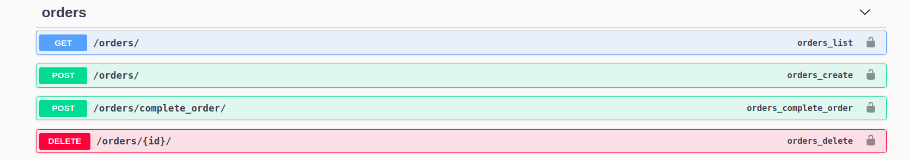

# store-api

This is a simple example of a REST API using Docker, Django, Django REST Framework,
and PostgreSQL for a store.

This little project makes possible for a user to be created, update their details 
(and password) (*/auth/user/*).

## Setup

It supposes you already have docker on your computer. So, just clone this repository 
and run:
```
$ docker-compose up

```
And it will be up and running on *localhost:8000* in a beautiful Swagger.


In order to add/alter products you will need a staff user. You can 
use the predefined superuser *user* and password *password* loaded from
a fixture. You can also run the command bellow (while the container is up)
and set up your own user:
```
$ docker exec -it store_seller_app ./manage.py createsuperuser

```

## Usage

Well, it is pretty much look around and do stuff. There is */auth/* that is for loging in
and user related operations (CRUD), */orders/* to make, complete and actual order, and 
alter it before it is finished.

There is also a *products/* to product search and alteration (only for staff users) and
*staff-order-control* as well for a staff member to alter some status of orders.





